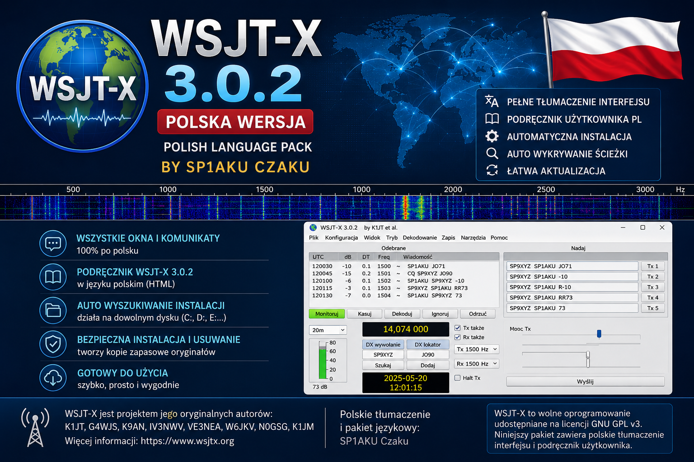
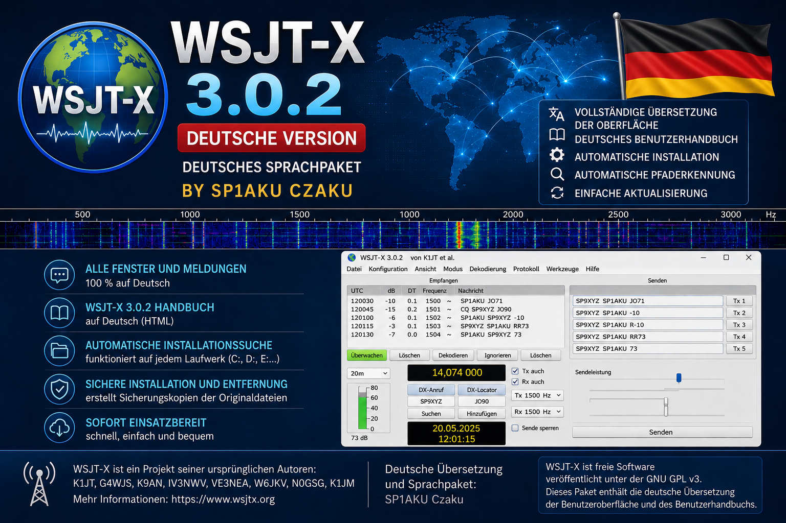

# 🇩🇪 WSJT-X 3.0.2 – Polnische & deutsche Sprachpakete

**Sprache:** [🇵🇱 Polski](README_PL.md) · [🇬🇧 English](README_EN.md) · 🇩🇪 **Deutsch** · [🏠 Startseite](README.md)

<table>
<tr>
<td align="center"></td>
<td align="center"></td>
</tr>
</table>

Inoffizielle **polnische und deutsche** Sprachpakete für **WSJT-X 3.0.2**, erstellt von **SP1AKU Czaku**.

> WSJT-X bleibt das Werk seiner ursprünglichen Autoren und des WSJT Development Teams. Die Kennzeichnung **SP1AKU Czaku** bezieht sich auf die PL/DE-Übersetzungen, zusätzliche Dokumentation und die Sprachpaket-Installer – nicht auf die Urheberschaft von WSJT-X selbst.

## ⬇️ Neueste Version herunterladen

<table>
<tr>
<td align="center"><a href="../../releases/latest/download/WSJTX_3.0.2_PL_FULL_FIX3_SP1AKU_Czaku_AUTO_PATH.zip"></a></td>
<td align="center"><a href="../../releases/latest/download/WSJTX_3.0.2_DE_FULL_FIX3_SP1AKU_Czaku_AUTO_PATH.zip"></a></td>
</tr>
<tr>
<td align="center"><a href="../../releases/latest/download/WSJTX_3.0.2_LINUX_PL_SP1AKU_Czaku.zip"></a></td>
<td align="center"><a href="../../releases/latest/download/WSJTX_3.0.2_LINUX_DE_SP1AKU_Czaku.zip"></a></td>
</tr>
</table>

**Linux PL + DE:** [Kombiniertes Paket herunterladen](../../releases/latest/download/WSJTX_3.0.2_LINUX_PL_DE_SP1AKU_Czaku.zip) · [Alle Releases](../../releases/latest)

## Inhalt des Repositorys

- `translations/wsjtx_pl.ts` – polnische Qt-Übersetzungsquelle
- `translations/wsjtx_de.ts` – deutsche Qt-Übersetzungsquelle
- `compiled/` – kompilierte `.qm`-Sprachdateien
- `docs/` – vollständige polnische und deutsche HTML-Benutzerhandbücher
- `installers/windows/` – Windows-Installationsskripte mit automatischer Pfaderkennung
- `installers/linux/` – Linux-Installations- und Deinstallationsskripte
- `patches/` – i18n-Patch für ausgewählte fest codierte UI-Texte in WSJT-X 3.0.2

## Übersetzungsstatus

| Sprache | Locale | Einträge | `unfinished` | Leer | Qt-Platzhalterfehler |
|---|---:|---:|---:|---:|---:|
| Polnisch | pl_PL | 1824 | 0 | 0 | 0 |
| Deutsch | de_DE | 1804 | 0 | 0 | 0 |

Standardisierte Amateurfunk-Bezeichnungen und Abkürzungen wie FT8, FT4, Q65, WSPR, CAT, PTT, DXCC, LoTW und Hamlib bleiben dort in ihrer üblichen technischen Form, wo dies sinnvoll ist.

## Windows

Die Windows-Pakete erkennen WSJT-X auch bei einer Installation auf einem anderen Laufwerk, z. B. `D:` oder `E:`. Falls die automatische Erkennung fehlschlägt, kann der Installationspfad manuell ausgewählt werden.

Der polnische Launcher startet WSJT-X mit `--language=pl`, der deutsche mit `--language=de`.

## Linux

Für das polnische Paket:

```bash
chmod +x install_pl.sh uninstall_pl.sh
./install_pl.sh
```

Für das deutsche Paket:

```bash
chmod +x install_de.sh uninstall_de.sh
./install_de.sh
```

## i18n-Patch

`patches/WSJTX_3.0.2_I18N_HARDCODED_TEXTS.patch` betrifft mehrere sichtbare Texte in WSJT-X 3.0.2, die im Originalcode nicht über Qt `tr()` laufen. Eine `.qm`-Datei allein kann diese Texte in einer unveränderten offiziellen `wsjtx.exe` nicht übersetzen; der Patch ist für Entwickler bzw. Builds aus dem Quellcode vorgesehen.

## Dokumentation

- [Vollständiges polnisches Benutzerhandbuch](docs/PL/wsjtx-main-3.0.2.html)
- [Vollständiges deutsches Benutzerhandbuch](docs/DE/wsjtx-main-3.0.2.html)

## Autor der Sprachpakete

**SP1AKU Czaku**

73!

## Lizenzhinweis

Dieses Repository enthält abgeleitete Übersetzungsmaterialien auf Basis von WSJT-X 3.0.2. Urheberrecht und Lizenz des ursprünglichen WSJT-X verbleiben beim WSJT-Projekt und seinen Mitwirkenden. Die originale WSJT-X-Datei `COPYING` ist enthalten. Siehe auch [LICENSE-NOTICE.md](LICENSE-NOTICE.md).
